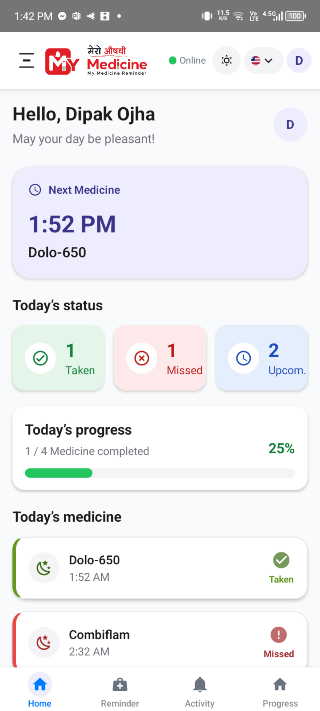
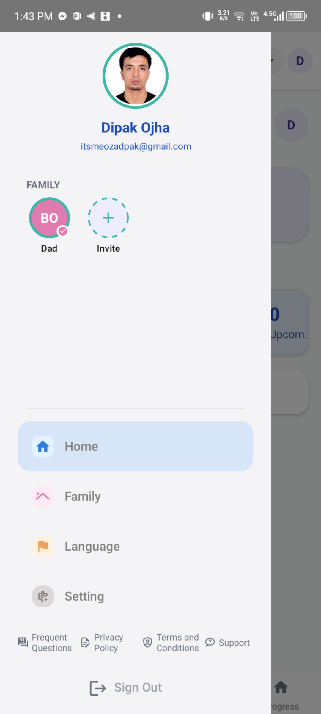
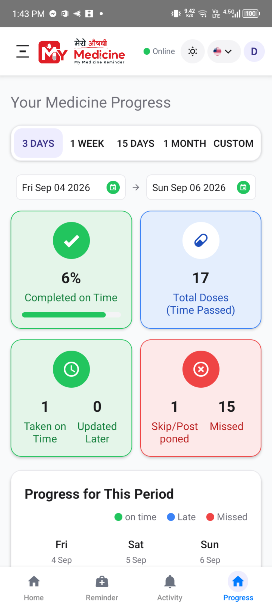
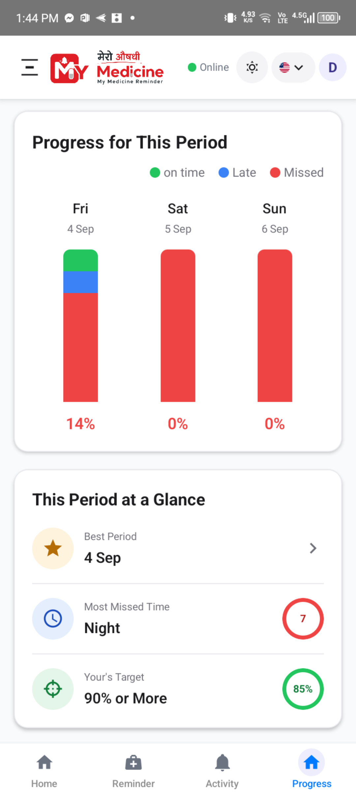
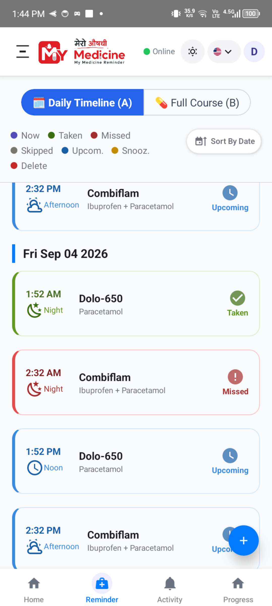
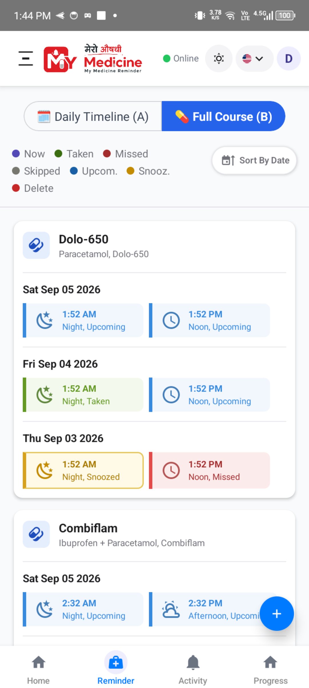
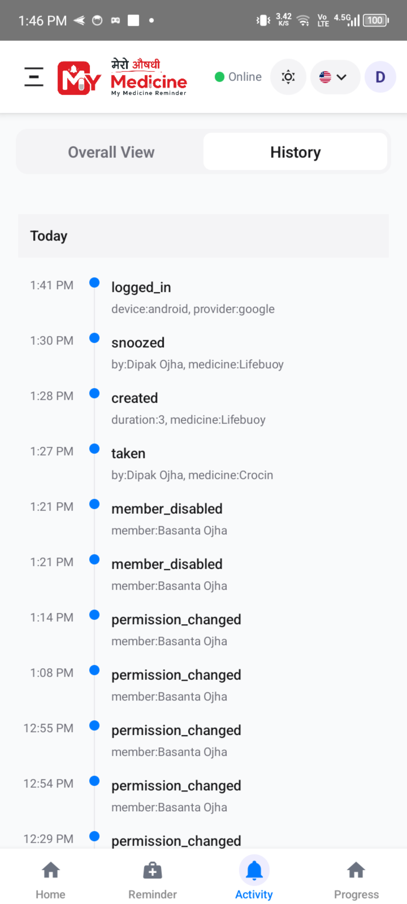
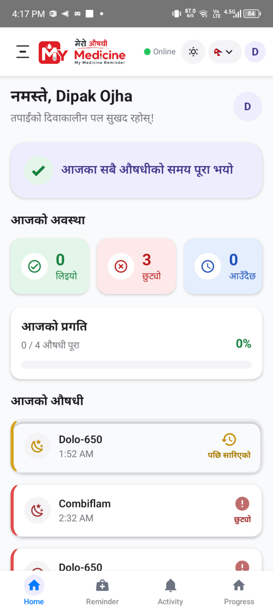

# My Medicine 💊

**My Medicine** is a cross-platform medicine reminder and medication tracking application built with **React Native** for Android and iOS.

The application helps users manage medicines, schedule reminders, track medication activity, maintain medicine records, and organize medication-related information for family members.

The app is designed with an **offline-first architecture**, allowing essential data and functionality to remain available even when an internet connection is unavailable.

## 🚀 Features

### ⏰ Reliable Medicine Reminders
Schedule medicine reminders and receive notifications at the right time, with native Android integration for reliable reminder delivery.

### 📊 Progress Analytics
Track medication progress over time with meaningful summaries and analytics, helping users understand their medication-taking patterns.

### 📝 Activity Tracking
Keep a record of relevant user activities and medication events. Activity logs help maintain a history of actions performed within the application.

### 👨‍👩‍👧 Family Management
Organize medicine-related information for family members and manage family relationships within the application.

### 📴 Offline-First
Core functionality remains available even without an internet connection, making the application practical for environments with unreliable or limited connectivity.

### 📱 Designed for Low-Resource Devices
The application is designed with resource-conscious mobile usage in mind, with consideration for older and lower-specification Android devices commonly used in areas where device resources and connectivity may be limited.

### 🌐 Extensible Multilingual Support
The application uses a structured localization system with language-specific translation keys maintained separately from the application logic. This keeps UI text independent from the codebase and makes the application easily extensible to additional languages without hardcoding language-specific content into the application.
Currently supports English, Nepali, and Hindi, with the localization architecture designed to make adding additional languages straightforward.

### 📅 Nepali Calendar Support
Supports the Bikram Sambat (BS) calendar for users who prefer Nepali date formats.

### 🔐 Authentication
Supports multiple authentication methods, including:
- Google Sign-In
- Facebook Login
- Username & Password authentication

### ⚙️ Personalized Settings
Users can configure their own application preferences and settings according to their needs.

### 🔄 Automatic Local & Remote Data Synchronization
The application automatically synchronizes data between the local SQLite database and Firebase/Firestore, keeping user data consistent across offline and online states.

## 🏗️ Core Technical Architecture

My Medicine follows a **local-first, synchronization-driven architecture** designed to keep the application usable across offline and online environments.

```text
                    ┌─────────────────────┐
                    │     React Native    │
                    │     Application     │
                    └──────────┬──────────┘
                               │
                               ▼
                    ┌─────────────────────┐
                    │       SQLite        │
                    │   Local Database    │
                    └──────────┬──────────┘
                               │
                    ┌──────────┴──────────┐
                    │                     │
                    ▼                     ▼
             Local Session          Sync Engine
                    │                     │
                    │             ┌───────┴───────┐
                    │             │               │
                    │             ▼               ▼
                    │          Pull Engine    Push Engine
                    │             │               │
                    │             ▼               ▼
                    │        Remote Changes   Sync Queue
                    │             │               │
                    │             └───────┬───────┘
                    │                     │
                    │                     ▼
                    │             Firebase / Firestore
                    │
                    ▼
                App Ready
```

### Local Database Foundation

SQLite is initialized and database migrations are completed before database-dependent application providers are mounted.

This establishes the local database as the foundation of the application rather than treating it as an optional cache.

### Local Session Restoration

Authentication state is restored from the local database.

For an existing installation, the application can become ready from locally available state without waiting for a remote authentication or synchronization request.

### Independent Application Initialization & Synchronization

Application readiness and remote synchronization are intentionally separated.

```text
SQLite Ready
     │
     ▼
Restore Local Session
     │
     ▼
App Ready
     │
     └──────────────► Background Synchronization
```

This prevents network availability from unnecessarily blocking application startup.

### Automatic Local & Remote Data Synchronization

The application automatically synchronizes data between the **local SQLite database** and **Firebase/Firestore**.

The synchronization architecture includes:

- **Push** — Sends locally created or modified data to the remote database.
- **Pull** — Retrieves remote changes and applies them to SQLite.
- **Sync Queue** — Tracks pending local operations until they can be synchronized.
- **Network-Aware Sync** — Performs synchronization when connectivity becomes available.
- **Incremental Sync** — Uses synchronization timestamps to retrieve relevant changes instead of repeatedly processing the complete dataset.
- **Paginated Pulls** — Processes larger datasets using cursors and multiple pages.
- **Domain-Based Sync** — Uses dedicated synchronization handlers for individual application domains.
- **Realtime Updates** — Starts realtime listeners after the initial remote state has been established.
- **Cancellation-Safe Operations** — Cleans up active synchronization and listeners when the synchronization context changes.

### Domain-Based Synchronization

Remote data is synchronized into SQLite through dedicated application domains:

```text
Remote Data
    │
    ├── Notifications
    ├── Reminders
    │     ├── Occurrences
    │     └── Events
    ├── Activity Logs
    ├── Family Members
    ├── Family Invites
    ├── Settings
    └── Related User Records
             │
             ▼
       Local SQLite
```

This keeps synchronization logic modular and allows individual domains to become available progressively.

### Progressive Data Readiness

Large datasets are processed incrementally.

For example, the first page of reminder data can make the reminder domain available to the UI while subsequent pages continue synchronizing in the background.

This reduces unnecessary coupling between **complete remote synchronization** and **UI availability**.

---


### Architecture Overview

The architecture is built around three primary layers:

**1. Application Layer**

React Native handles the main application experience, including:

- Screens and forms
- State management
- Business logic
- User interactions
- Multilingual UI

**2. Local & Synchronization Layer**

SQLite acts as the local data store while the synchronization engine manages communication between local data and Firebase.

- Local persistence
- Offline access
- Push synchronization
- Pull synchronization
- Sync queue
- Network-aware synchronization
- Remote change processing

**3. Cloud & Native Services**

Firebase provides authentication and cloud data storage, while native Android components handle platform-specific reminder functionality.

- Firebase Authentication
- Firestore
- Google Sign-In
- Android AlarmManager
- Native Kotlin reminder services
- Full-screen reminder experience

### 📦 Local Data Model

The local SQLite database manages the application's operational data and provides the primary local data layer for offline-first operation.

* **Medicines** — Medicine records and information used throughout the application.
* **Reminders** — Reminder definitions, schedules, and medication timing configuration.
* **Occurrences** — Individual scheduled instances generated from reminder schedules.
* **Events** — Recorded actions and state changes associated with medication reminders and occurrences.
* **Family Members** — Family relationships, member associations, and related access information.
* **Family Invites** — Pending and processed invitations between users for family relationships.
* **Activity Logs** — Historical records of relevant user and application activities.
* **Notifications** — Locally managed notification records and notification-related state.
* **User Settings** — User-specific preferences and application configuration.
* **Sync Queue** — Pending local create, update, and delete operations waiting to be synchronized with the remote database.
* **Sync Metadata** — Synchronization timestamps and state used to determine which remote changes need to be processed.

The local data model is designed so that the application can perform its core operations against **SQLite first**, while the synchronization layer coordinates changes between the local database and **Firebase/Firestore**.

Keeping this data locally allows the application to continue functioning when network connectivity is unavailable.

### 🔗 Reminder → Occurrence → Event

A reminder defines **when medication should happen**, an occurrence represents a **specific scheduled instance**, and an event records the **user's action** — Taken, Snoozed, or Skipped.

```text
Reminder
   │
   ├── defines the schedule
   │
   └── generates
          │
          ▼
     Occurrences
          │
          └── user actions
                  │
                  ▼
                Events
             ┌────┼─────┐
             ▼    ▼     ▼
           Taken Snoozed Skipped
```
---

## 🔄 Synchronization Flow

The authenticated synchronization lifecycle follows this general flow:

```text
Application Start
       │
       ▼
Initialize SQLite + Migrations
       │
       ▼
Restore Local Session
       │
       ▼
Application Ready
       │
       ├──────────────► Initialize Device
       │
       ├──────────────► Initialize Notifications
       │
       ├──────────────► Schedule Reminders
       │
       ├──────────────► Start Push Sync
       │
       └──────────────► Start Pull Sync
                              │
                              ▼
                       Read Last Sync Time
                              │
                              ▼
                       Fetch Remote Changes
                              │
                ┌─────────────┼─────────────┐
                ▼             ▼             ▼
          Notifications   Reminders    Activity Logs
                │             │             │
                └─────────────┼─────────────┘
                              ▼
                         Family Data
                              │
                              ▼
                           Settings
                              │
                              ▼
                    Initial Sync Complete
                              │
                              ▼
                     Realtime Listeners
```

The sync system is designed to handle:

- Offline changes
- Pending operations
- Network availability
- Remote changes
- Synchronization metadata
- Conflict-related state

This approach allows the application to provide a consistent experience across offline and online environments.


### 🔔 Native Android Integration

The core application is written in React Native, while platform-specific reminder functionality is implemented using native Android components.

**Kotlin + Android AlarmManager** are used where native scheduling and reminder behavior are required.

The native layer communicates with React Native through a bridge, allowing the application to combine cross-platform UI and business logic with platform-specific Android capabilities.

## 🛠️ Technology Stack

| Area | Technology |
|---|---|
| Mobile | React Native |
| Language | TypeScript |
| Local Database | SQLite |
| Cloud Database | Firebase / Firestore |
| Authentication | Firebase Authentication |
| Native Android | Kotlin |
| Notifications | Notifee / Android AlarmManager |
| UI | NativeWind |
| Build & Development | React Native CLI, Gradle |
| Version Control | Git / GitHub |

## 📱 Screenshots

These screenshots demonstrate the application's main workflows and user experience.

> 
> 
> 
> 
> 
> 
> 
> 

---

## 🚧 Ongoing Development

### v1.1

The next release focuses on making medicine entry and reminders more accessible, intelligent, and personalized.

### 💊 Own Medicine Database

Includes a built-in database containing **1,000+ medicines** to simplify medicine entry and provide structured medicine information.

### 📷 Medicine Name Detection

Uses **OCR-based medicine name detection** to reduce manual data entry when adding medicines.

### 🔊 Voice Mode & Notification Voice Packs

Introduces voice-based interaction and customizable voice language packs for medicine reminder notifications, making reminders more accessible and easier to understand.

---

## 🧩 Engineering Challenges

Building My Medicine involved solving several practical engineering problems, including:

- Designing an offline-first data architecture
- Synchronizing local SQLite data with Firestore
- Managing pending operations through a synchronization queue
- Handling network availability and delayed synchronization
- Scheduling reliable medication reminders
- Integrating native Android functionality with React Native
- Supporting multiple languages and Nepali calendar requirements
- Maintaining consistent application state across offline and online modes
- Designing the data model for medicine, reminders, occurrences, events, and family relationships

These challenges helped shape the application's architecture beyond a simple CRUD-based mobile application.

## 🔐 Privacy & Security

The application is designed with user privacy and secure data handling in mind.

Sensitive configuration values and credentials are not included in this repository.

The public repository contains project documentation and selected demonstration materials rather than the complete production source code.

## 📦 Availability

My Medicine is currently available for Android Closed Testing through Google Play.

The iOS release is planned after the Android production release.

*Links will be added when available.*

## 🎯 Project Goal

My Medicine was built to explore how a real-world mobile application can remain useful under practical constraints such as:

- unreliable internet connectivity
- limited device resources
- large amounts of local application data
- synchronization between local and remote state
- reliable medication reminders
- multilingual user interfaces
- native platform requirements

The project combines **React Native, SQLite, Firebase, synchronization architecture, and native Android development** into a production-oriented mobile application.

## 👨‍💻 About the Developer

**Dipak Ojha**  
Full Stack Developer

Working primarily with:

**React • React Native • TypeScript • Laravel • PHP • MySQL • SQLite • Firebase**

[GitHub](https://github.com/ojhacode)

---
